# Project Cortex

Project Cortex is a real-time DirectX 12 hybrid renderer. It combines a
visibility-buffer raster path with ray-traced shadows, reflections, GI targets,
temporal denoising, physically classified materials, image-based lighting,
particles, cinematic post controls, and repeatable release validation.

The project also includes optional LLM and diffusion-texture tooling, but the
main artifact is the renderer: measurable frames, public showcase scenes,
runtime contracts, and package checks that can be rebuilt and rerun locally.

## Screenshots

These captures were generated at 1920x1080 with the `public_high` graphics
preset:

| RT Showcase | Material Lab |
|---|---|
| 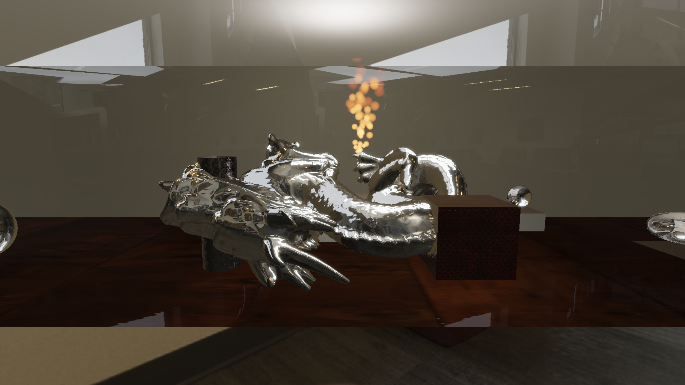 | 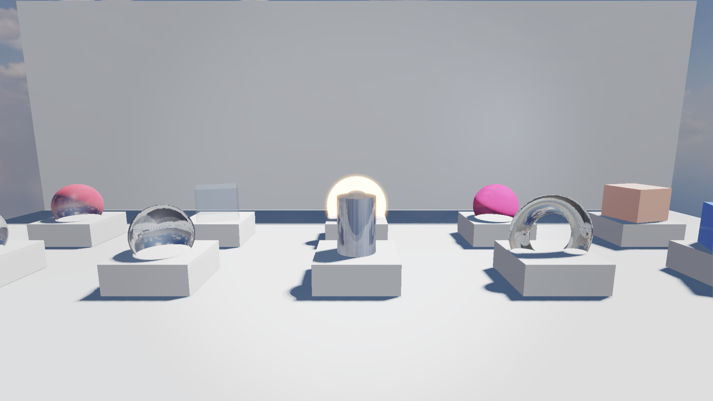 |

| Glass and Water | Effects Showcase |
|---|---|
| 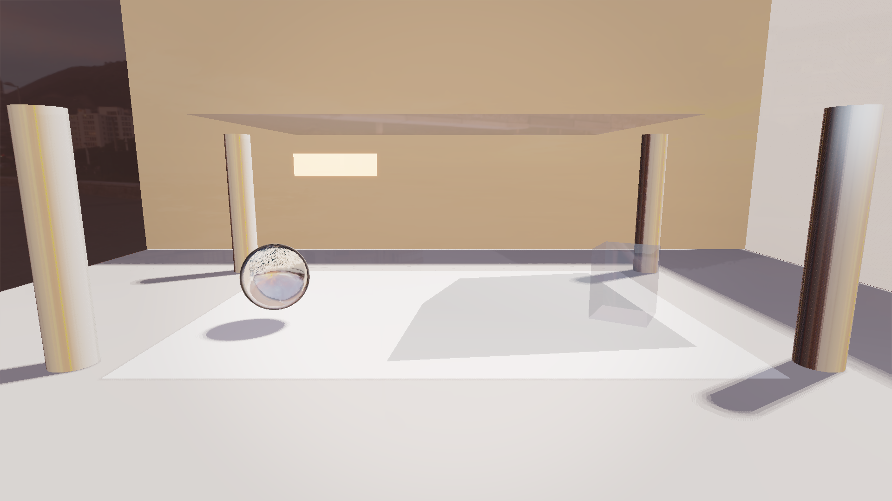 | 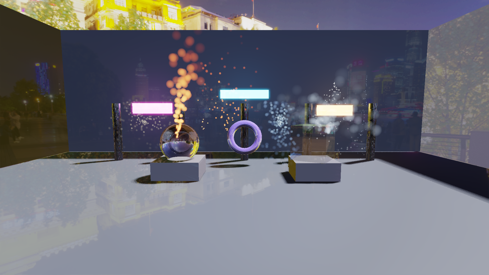 |

| Outdoor Sunset Beach | IBL Gallery |
|---|---|
| 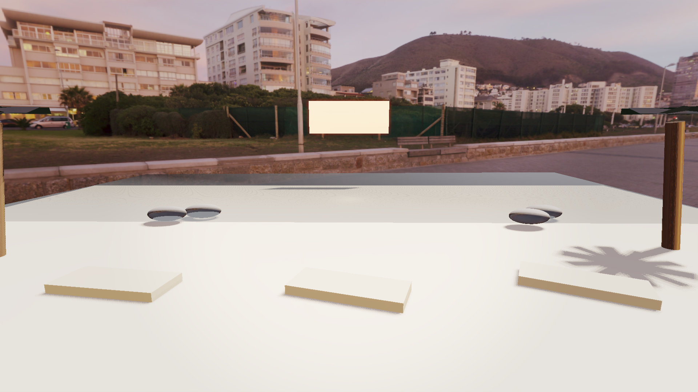 | 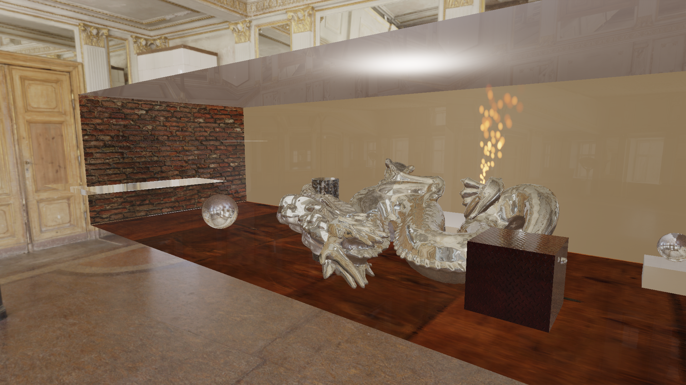 |

The capture manifest is [docs/media/gallery_manifest.json](docs/media/gallery_manifest.json).

Detail captures:

| Reflections | RT Materials | Metal Closeup | Glass and Emissive |
|---|---|---|---|
| 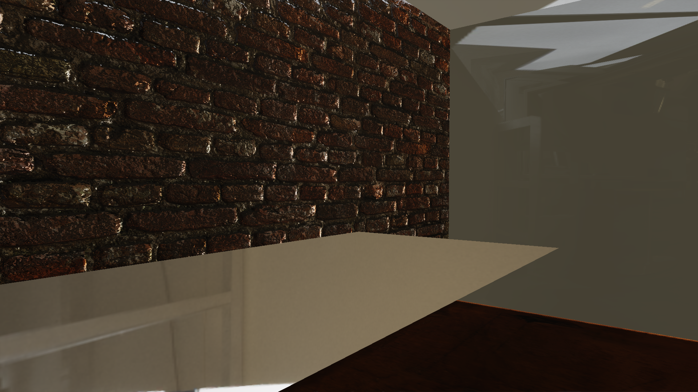 | 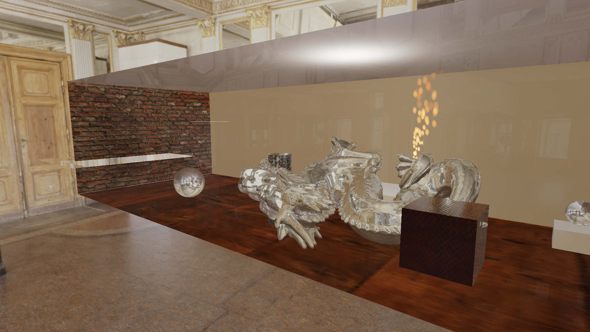 | 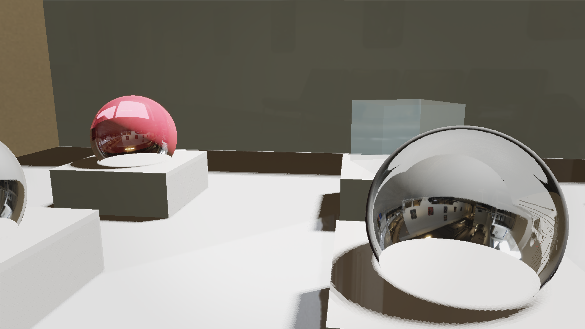 | 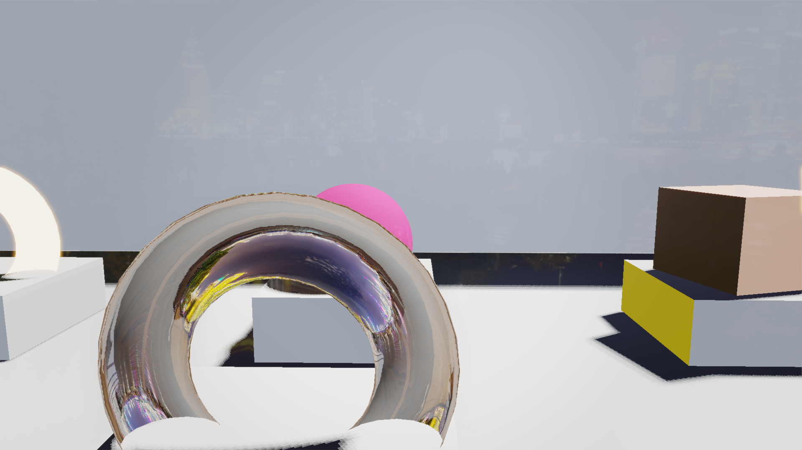 |

| Water | Glass Canopy | Particles | Neon Materials |
|---|---|---|---|
| 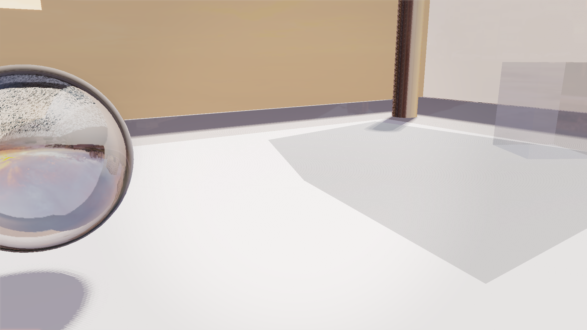 | 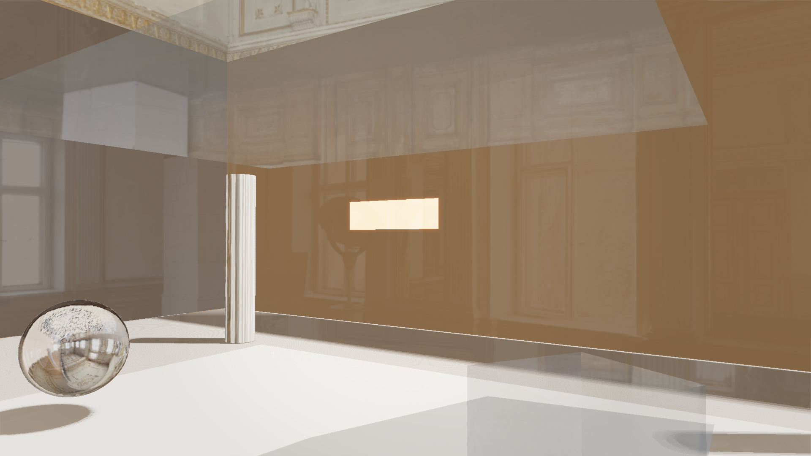 | 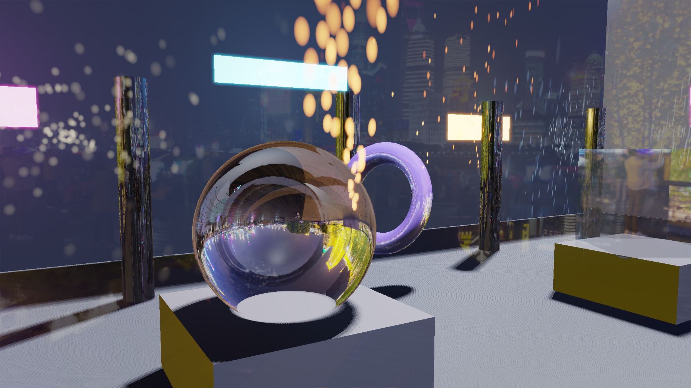 | 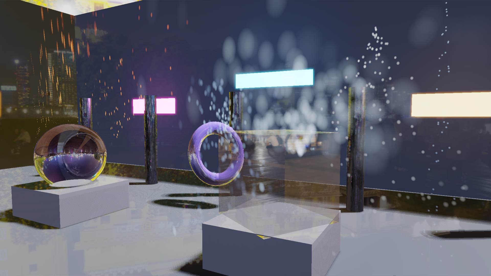 |

| Outdoor Waterline | IBL Hero |
|---|---|
| 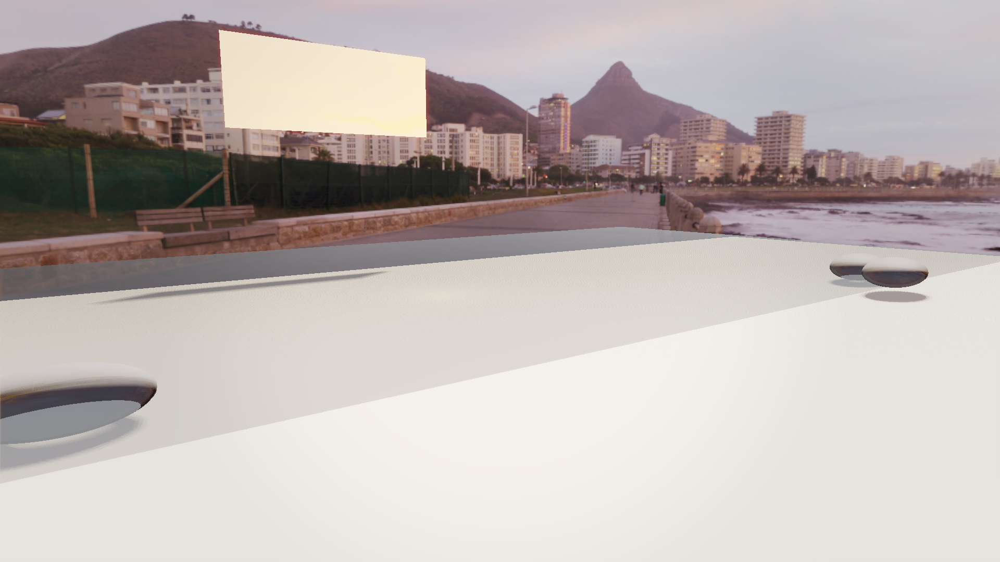 | 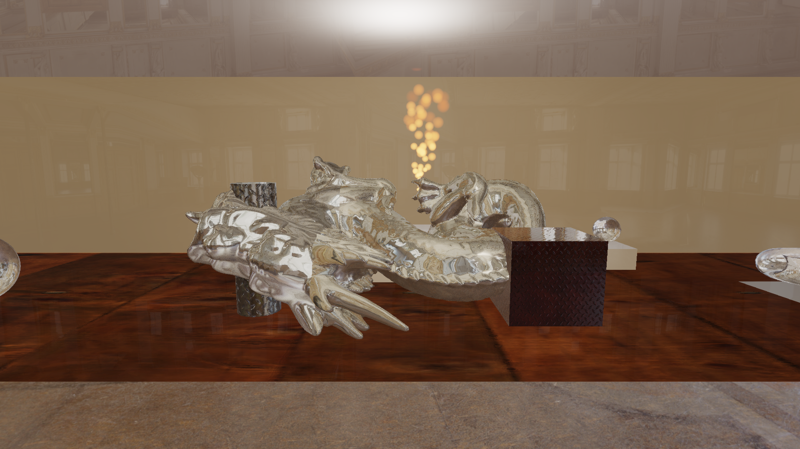 |

Short reel: [docs/media/cortex_gallery_reel.mp4](docs/media/cortex_gallery_reel.mp4)
with metadata in [docs/media/video_manifest.json](docs/media/video_manifest.json).

Regenerate it with:

```powershell
powershell -NoProfile -ExecutionPolicy Bypass -File CortexEngine/tools/run_public_capture_gallery.ps1 -NoBuild -Quality High -OutputDir CortexEngine/docs/media
```

Regenerate the short gallery reel with:

```powershell
powershell -NoProfile -ExecutionPolicy Bypass -File CortexEngine/tools/run_public_gallery_reel.ps1
```

## What It Shows

- Hybrid DX12 rendering: visibility buffer, forward fallback, GPU culling,
  HZB, TAA, SSAO, SSR, bloom, tone mapping, and debug views.
- Ray tracing with contracts: scheduler intent, TLAS/material readiness,
  reflection dispatch readiness, raw reflection signal, and denoised history
  signal.
- Material coverage: mirror, glass, water, brushed metal, emissive, wet,
  anisotropic, clearcoat, transmission, sheen, and procedural-mask presets.
- Environment/IBL policy: manifest-driven environments, budget classes,
  runtime fallback behavior, and gallery validation.
- Public scenes: RT Showcase, Material Lab, Glass and Water Courtyard,
  Effects Showcase, Outdoor Sunset Beach, and IBL Gallery.
- Release discipline: frame contracts, resource contracts, visual probes,
  package manifest checks, staged package launch smoke, and repo hygiene gates.

## Current Metrics

Source run:
`CortexEngine/build/bin/logs/runs/public_capture_gallery_20260512_151920_699_36360_0cb5c88e`

| Scene | GPU ms | Capture | Render scale | Avg luma | Nonblack | RT signal/history |
|---|---:|---:|---:|---:|---:|---:|
| RT Showcase | 4.02 | 1920x1080 | 1.00 | 70.34 | 1.000 | 0.0228 / 0.0295 |
| RT Reflection Closeup | 8.17 | 1920x1080 | 1.00 | 55.78 | 1.000 | 0.0293 / 0.0294 |
| RT Material Overview | 4.61 | 1920x1080 | 1.00 | 107.89 | 1.000 | 0.0335 / 0.0336 |
| Material Lab | 4.77 | 1920x1080 | 1.00 | 183.16 | 1.000 | 0.0214 / 0.0224 |
| Material Lab Metal Closeup | 3.59 | 1920x1080 | 1.00 | 134.23 | 1.000 | 0.0752 / 0.0765 |
| Material Lab Glass and Emissive | 3.63 | 1920x1080 | 1.00 | 169.42 | 1.000 | 0.0942 / 0.0956 |
| Glass and Water Courtyard | 3.78 | 1920x1080 | 1.00 | 180.86 | 1.000 | 0.0392 / 0.0404 |
| Water Reflection Closeup | 3.69 | 1920x1080 | 1.00 | 197.19 | 1.000 | 0.0549 / 0.0580 |
| Glass Canopy Rim Light | 3.60 | 1920x1080 | 1.00 | 140.52 | 1.000 | 0.0171 / 0.0181 |
| Effects Showcase | 3.99 | 1920x1080 | 1.00 | 110.48 | 1.000 | 0.0042 / 0.0042 |
| Particle and Bloom Closeup | 4.27 | 1920x1080 | 1.00 | 92.98 | 1.000 | 0.0288 / 0.0290 |
| Neon Materials | 4.05 | 1920x1080 | 1.00 | 94.46 | 1.000 | 0.0110 / 0.0111 |
| Outdoor Sunset Beach | 3.03 | 1920x1080 | 1.00 | 169.96 | 1.000 | 0.0048 / 0.0048 |
| Outdoor Waterline | 2.94 | 1920x1080 | 1.00 | 181.49 | 1.000 | 0.0162 / 0.0162 |
| IBL Gallery Hero | 4.05 | 1920x1080 | 1.00 | 101.72 | 1.000 | 0.0420 / 0.0423 |
| IBL Gallery Sweep | 4.07 | 1920x1080 | 1.00 | 107.90 | 1.000 | 0.0335 / 0.0336 |

Release validation also checks descriptor pressure, memory budgets, RT budget
profiles, visual probes, and package launch behavior. See
[RELEASE_READINESS.md](RELEASE_READINESS.md) for the current gate summary.

## Quick Start

From the repository root:

```powershell
powershell -ExecutionPolicy Bypass -File CortexEngine/setup.ps1
powershell -ExecutionPolicy Bypass -File CortexEngine/run.ps1
```

From `CortexEngine`, the usual local run is:

```powershell
.\run.ps1
```

## Run Modes

Default startup is meant to be robust on a wider range of machines. Public
captures and validation use explicit presets so the output is reproducible.

```powershell
# Safe startup profile used by package launch smoke
.\build\bin\CortexEngine.exe --scene temporal_validation --graphics-preset safe_startup --environment studio --no-llm --no-dreamer --no-launcher

# Release showcase profile used by runtime gates
.\build\bin\CortexEngine.exe --scene rt_showcase --camera-bookmark hero --graphics-preset release_showcase --environment studio --no-llm --no-dreamer --no-launcher

# High-resolution public capture profile
.\build\bin\CortexEngine.exe --scene rt_showcase --camera-bookmark hero --graphics-preset public_high --environment studio --window-width 1920 --window-height 1080 --no-llm --no-dreamer --no-launcher
```

## Validation

Run the full local release gate from the repository root:

```powershell
powershell -NoProfile -ExecutionPolicy Bypass -File CortexEngine/tools/run_release_validation.ps1
```

The gate rebuilds Release and runs renderer contracts, temporal/RT smokes,
visual probes, graphics UI tests, material and IBL checks, effects checks,
ownership audits, package manifest validation, staged package launch smoke,
budget profiles, and repo hygiene.

Useful focused gates:

```powershell
powershell -NoProfile -ExecutionPolicy Bypass -File CortexEngine/tools/run_visual_probe_validation.ps1 -NoBuild
powershell -NoProfile -ExecutionPolicy Bypass -File CortexEngine/tools/run_phase3_visual_matrix.ps1 -NoBuild
powershell -NoProfile -ExecutionPolicy Bypass -File CortexEngine/tools/run_release_package_contract_tests.ps1 -NoBuild
powershell -NoProfile -ExecutionPolicy Bypass -File CortexEngine/tools/run_release_package_launch_smoke.ps1 -NoBuild
powershell -NoProfile -ExecutionPolicy Bypass -File CortexEngine/tools/run_public_readme_contract_tests.ps1
```

## Architecture

- `src/Core`: engine loop, startup preflight, windowing, camera automation,
  frame reports, and release diagnostics.
- `src/Graphics`: DX12 renderer, RHI, render graph passes, RT scheduling,
  material resolution, environment/IBL, particles, post processing, and
  frame/resource contracts.
- `src/Scene`: EnTT-based scene registry and components.
- `src/UI`: native graphics controls, material controls, performance views,
  and editor-facing tools.
- `src/AI`: optional LLM scene commands and optional diffusion texture
  generation paths.
- `tools`: repeatable build, validation, screenshot, package, and release
  readiness scripts.

## Packaging

The public-review payload is manifest-driven by
`assets/config/release_package_manifest.json`.

```powershell
powershell -NoProfile -ExecutionPolicy Bypass -File CortexEngine/tools/run_create_release_package.ps1 -NoBuild
```

The package scripts exclude local models, logs, build caches, debug artifacts,
and source HDR/EXR environment files. The staged package launch smoke copies the
selected runtime payload to an isolated directory and launches it from there.

## Limitations

- Validation numbers are hardware dependent. The current local evidence was
  produced on a Windows/DX12 machine with an NVIDIA RTX 3070 Ti.
- The LLM and Dreamer texture paths are optional. Most renderer gates run with
  `--no-llm --no-dreamer`.
- The voxel backend is experimental and smoke-tested; it is not the main
  renderer path.
- Materials, effects, and cinematic post are validated as public foundations,
  but deeper content authoring and larger stress scenes remain ongoing renderer
  work rather than finished game content.

## License and Usage

Project Cortex is a learning and research project. Review the licenses of
third-party libraries and models before using it commercially.
