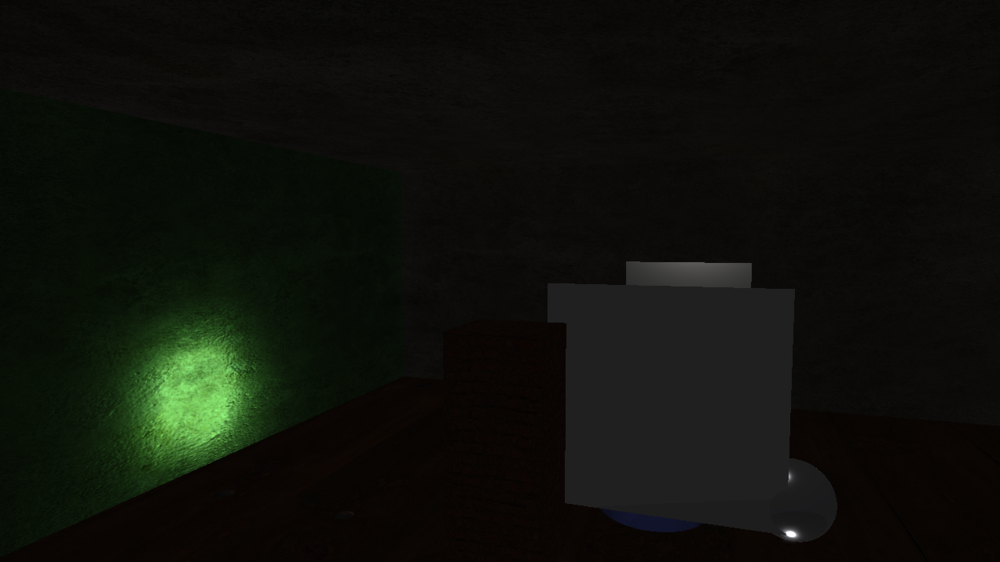
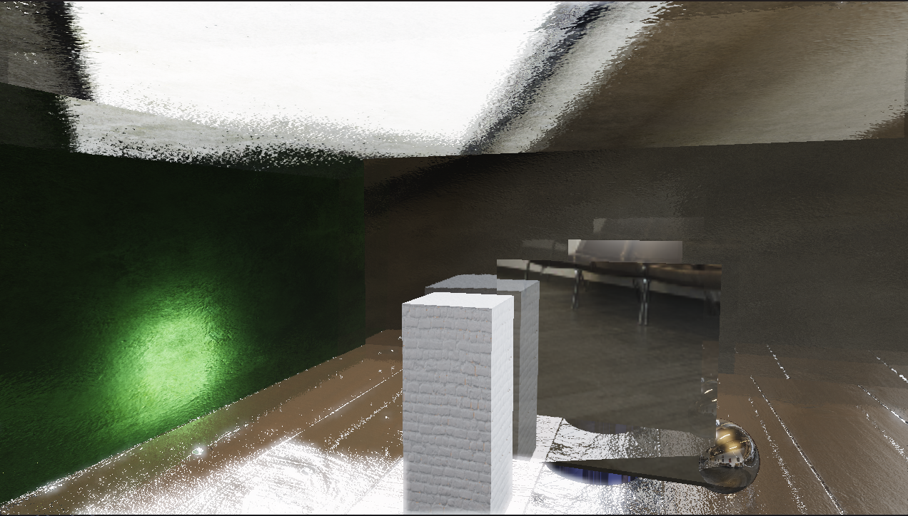
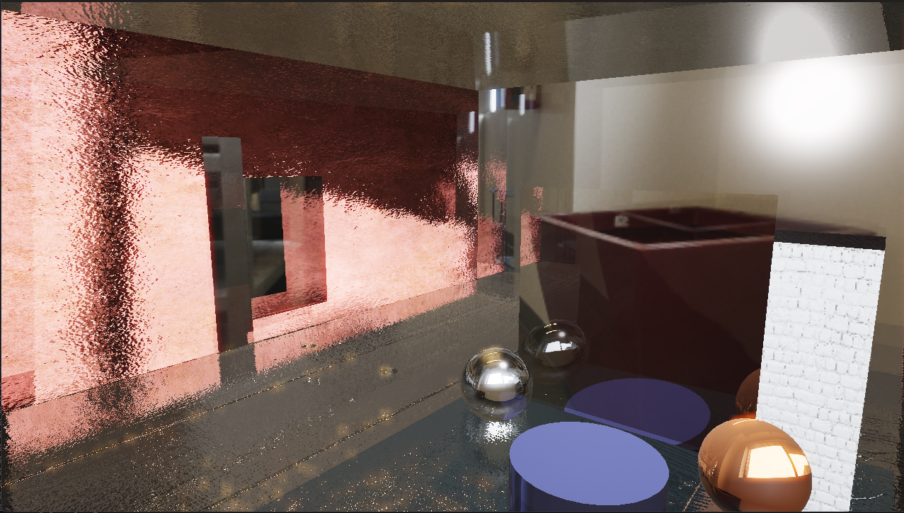
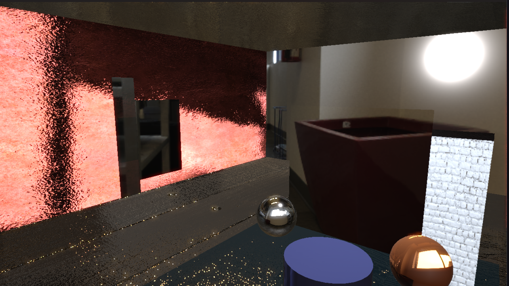
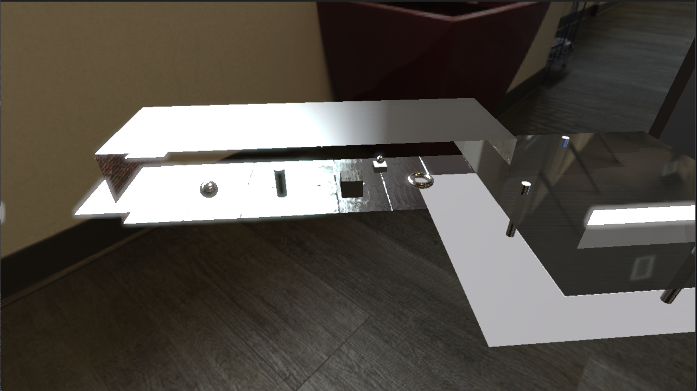

# Project Cortex

A real-time DirectX 12 rendering engine with integrated AI capabilities for natural language scene control and procedural texture generation.

## Overview

Project Cortex is a physically-based rendering engine built on DirectX 12, featuring:

- Forward PBR lighting with image-based lighting (IBL)
- Entity Component System (ECS) using EnTT
- Real-time post-processing (SSAO, SSR, bloom, TAA, FXAA)
- Cascaded shadow mapping
- Natural language scene manipulation via Llama.cpp
- Asynchronous texture generation with TensorRT (SDXL-Turbo)

This is a project demonstrating integration of modern graphics APIs with AI tooling for creative workflows.

## Gallery


*Basic scene with dynamic lighting and shadows*


*PBR materials with varying metallic and roughness properties*


*Screen-space reflections and image-based lighting*


*Multiple material types demonstrating PBR shading*


*Cascaded shadow map debug view*

## Quick Start

### Prerequisites

- Windows 10 or 11
- Visual Studio 2022 with Desktop C++ workload
- Git

### Build and Run

From the `CortexEngine` directory:

```powershell
powershell -ExecutionPolicy Bypass -File .\setup.ps1
.\run.ps1
```

The setup script will install dependencies (CMake, vcpkg, SDL3, DirectX headers, etc.), configure the build, and compile the engine. First run takes 15-25 minutes.

For detailed build instructions, see [CortexEngine/BUILD.md](CortexEngine/BUILD.md).

## Architecture

### Core Rendering

The renderer implements a forward PBR pipeline with:
- Physically-based materials (metallic-roughness workflow)
- Image-based lighting using HDR environment maps
- Cascaded shadow maps for directional lights
- Screen-space effects (SSAO, SSR)
- HDR bloom and tone mapping
- Temporal anti-aliasing

### AI Integration

**LLM Scene Control**
Natural language commands are processed by Llama.cpp and converted to structured JSON operations that manipulate the scene graph. Supports spawning entities, adjusting lights, modifying materials, and camera control.

**Texture Generation**
Background threads run SDXL-Turbo via TensorRT to generate textures on demand. Results are streamed into GPU memory without blocking frame rendering.

## Project Structure

```
CortexEngine/
  src/
    Core/           Engine loop, windowing, service locator
    Graphics/       DX12 RHI, renderer, shaders, post-processing
    Scene/          ECS components and systems
    AI/             LLM and diffusion services
    Utils/          File I/O, mesh generation, GLTF loading
  assets/           Shaders and textures
  build/            CMake output (ignored)
  models/           LLM and diffusion models (ignored)

src/                Sample scenes and utilities
glTF-Sample-Models/ Test assets
TensorRT/           TensorRT SDK
```

## Build Shortcuts

The root directory includes convenience scripts:

- `rebuild-release.bat` - Rebuild optimized Release build
- `rebuild-debug.bat` - Rebuild Debug build with symbols

Or use VS Code tasks (Ctrl+Shift+B).

## Debugging

Build the Debug configuration:

```bash
cmake --build CortexEngine/build --config Debug
```

Launch with VS Code debugger (F5). Debug builds are located at:
`CortexEngine/build/bin/Debug/CortexEngine.exe`

## Dependencies

Managed via vcpkg:
- SDL3 (windowing, input)
- EnTT (ECS)
- GLM (math)
- spdlog (logging)
- nlohmann-json (JSON parsing)
- DirectX-Headers (DX12)
- DirectXTK12 (DX12 utilities)

Additional:
- Llama.cpp (LLM inference)
- TensorRT (diffusion models)
- stb_image (texture loading)
- TinyEXR (HDR textures)

## License

This is a research and learning project. Check third-party library licenses (llama.cpp, TensorRT, SDXL-Turbo) before commercial use.
